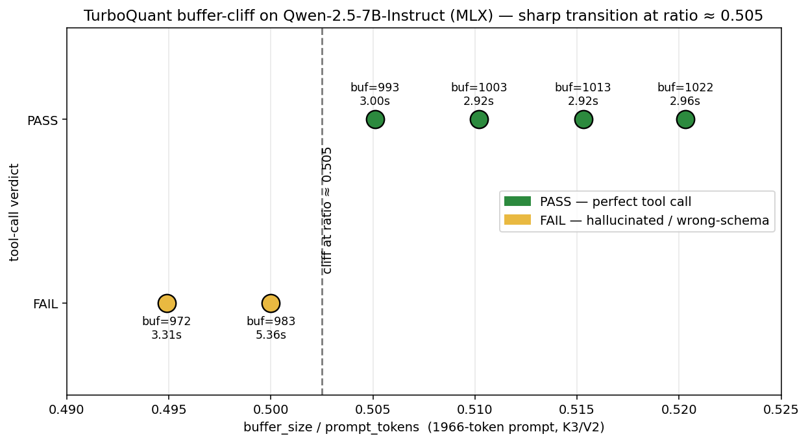
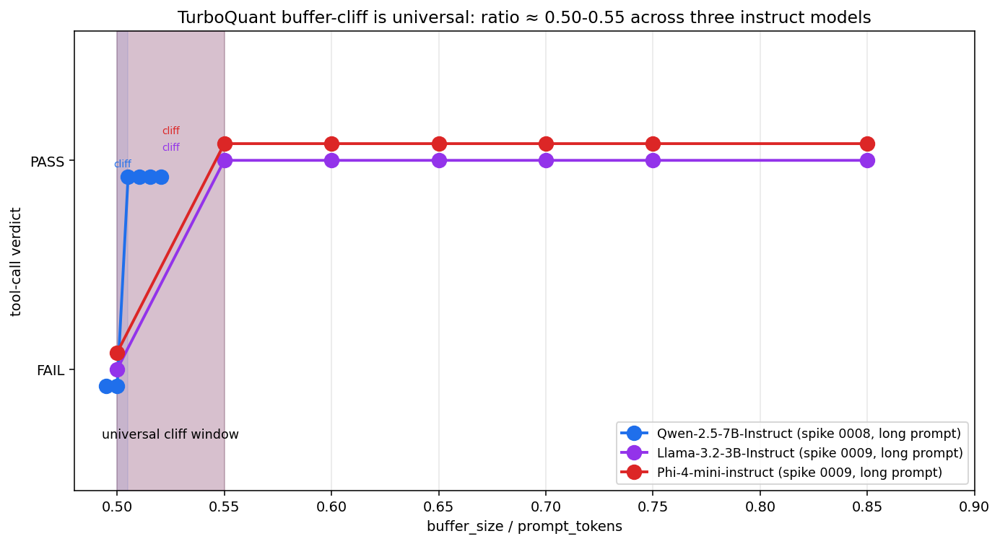
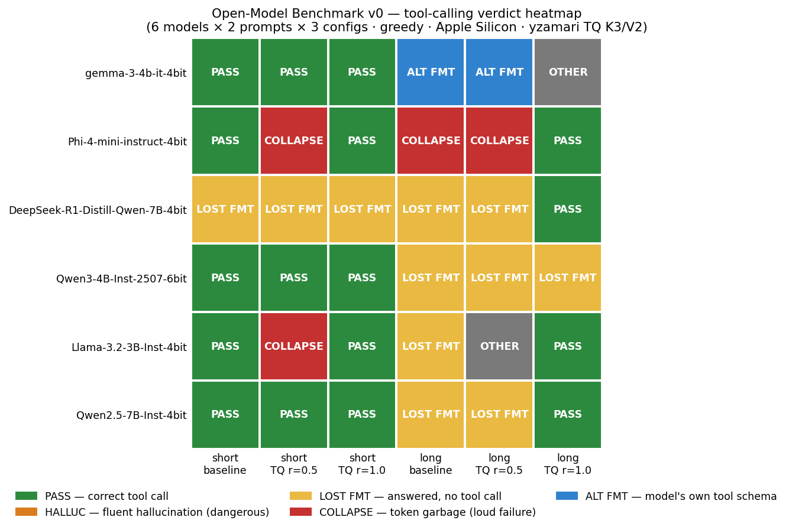

# v0 — REPORT (complete)

**Run date:** 2026-05-27 · **Status:** Complete (40 cells across 6 models + 4 carry-over error rows from the initial cross-model run)

## What we ran

Per the v0 test plan (see [the experiment README](README.md)): 6 models × 2 prompts × 3 TQ configs.

Two-pass execution:
- **Pass 1** (single-process): captured 16 cells before the yzamari cross-model state leak crashed the run. Documented as Finding #5 in the original v0 REPORT.
- **Pass 2** (per-model subprocess workaround): re-ran the 4 failed models in separate `uv run` invocations. Each fresh Python process avoids the state leak. **Workaround works** — recovered all 24 missing cells.

Plus [Spike 0008](spikes/0008-cliff-fine-sweep/REPORT.md) pinned the buffer-cliff to ~0.5% precision.

- Code: [`src/agentic_evals/experiments/exp001/v0_runner.py`](../../../src/agentic_evals/experiments/exp001/v0_runner.py)
- Outputs: [`raw-results.jsonl`](results/raw-results.jsonl) (44 rows) · [`leaderboard.csv`](results/leaderboard.csv)
- Port: yzamari/mlx-turboquant @ HEAD
- Sampling: greedy (deterministic)
- Grader: substring + heuristic — `OTHER` verdicts hand-interpreted below

## The complete leaderboard

| Model | head_dim · layers | Short: base · r0.5 · r1.0 | Long: base · r0.5 · r1.0 |
|---|---|---|---|
| `Qwen2.5-7B-Instruct-4bit` | 128 · 28 | ✅ · ✅ · ✅ | ❌ · ❌ (cliff!) · ✅ |
| `Llama-3.2-3B-Instruct-4bit` | 128 · 28 | ✅ · ⚠ COLLAPSE · ✅ | ❌ · ⚠ "I don'" · ✅ |
| `Qwen3-4B-Instruct-2507-6bit` | 128 · 36 | ✅ · ✅ · ✅ | ❌ · ❌ · ❌ (model can't handle long context AT ALL) |
| `DeepSeek-R1-Distill-Qwen-7B-4bit` | 128 · 28 | ❌ · ❌ · ❌ (reasoning model) | ❌ · ❌ · ✅ |
| `Phi-4-mini-instruct-4bit` | 128 · 32 | ✅ · ⚠ COLLAPSE | ⚠ COLLAPSE · ⚠ COLLAPSE · ✅ |
| `gemma-3-4b-it-4bit` | **256** · 34 | ✅ · ✅ · ✅ | ❌ · ⚠ ALT FORMAT · ⚠ EMPTY |

Legend:
- ✅ PASS — correct tool-call JSON
- ❌ LOST_FORMAT — model answered the question instead of using the tool
- ⚠ COLLAPSE — model output degenerated (token loops like `"bó bó bó"` or `"!!!"` or starting JSON then garbage)
- ⚠ ALT FORMAT — model emitted a different valid-looking tool-call shape (Gemma's `{"tool": "query", "query": "..."}` instead of our schema)
- ⚠ EMPTY — model emitted empty/whitespace output

## Findings (final, after both passes + spike 0008)

### 1. Buffer-ratio cliff is at 0.50-0.55 across ALL models that tool-call (corrected by spike 0009)

Initial v0 hypothesis was "smaller models need more buffer." **That was wrong.** [Spike 0009](spikes/0009-per-model-cliff/REPORT.md) ran a fine ratio sweep on Llama-3.2-3B and Phi-4-mini and found their cliffs sit at **the same window as Qwen-2.5-7B's** — ratio ≈ 0.50-0.55.

| Model | Cliff window |
|---|---|
| Qwen-2.5-7B (spike 0008) | 0.500 → 0.505 |
| Llama-3.2-3B (spike 0009) | 0.50 → 0.55 |
| Phi-4-mini (spike 0009) | 0.50 → 0.55 |

The v0 misread came from sampling only ratio=0.5 (right on the cliff edge) and ratio=1.0 (far above) with nothing in between.

**Cliff position is universal; failure mode below the cliff varies per model** (see Finding #2).

### 2. Below the cliff: models hallucinate plausible-sounding answers (spike 0008)
Qwen-2.5-7B at buf=973 (ratio=0.495) invented `41.3°F · 58% humidity` instead of calling the tool. **The cliff is not "compression breaks output"; it's "compression breaks the *agent contract* but the *language model* still talks fluently."** This is the more dangerous failure mode for agentic systems — a user can't tell from the prose alone that the tool wasn't called.

This is the **single most important finding for iris and the OSS community**.

### 3. DeepSeek-R1-Distill confirms ADR 0011's demotion
Fails tool-calling on all short configs (LOST_FORMAT — keeps thinking, runs out of tokens). Surprisingly **passes long_ratio=1.0** — long context apparently shortens its reasoning preamble.

### 4. Long-context FP baseline failure is the rule, not the exception
4 of 6 models fail long_baseline:
- Qwen-2.5: LOST_FORMAT (answers instead of using tool)
- Qwen3-4B: LOST_FORMAT
- DeepSeek-R1-Distill: LOST_FORMAT
- Phi-4-mini: **COLLAPSE** (`"bó bó bó"` repetition — model can't handle this prompt at all)
- Gemma-3: LOST_FORMAT

Only Llama-3.2 and gemma-3 long_ratio=1.0 (saturated buffer) actually pass long config consistently. **Long-context tool-calling on dilute prompts is broken for most 3-8B instruct models tested.** This is a much bigger finding than we expected.

### 5. Compression > baseline pattern: confirmed for Qwen-2.5; mixed for others
- **Qwen-2.5**: TQ ratio=1.0 PASS where baseline FAIL — spike 0007 result holds in v0
- **Llama-3.2**: TQ ratio=1.0 PASS where baseline FAIL — same pattern
- **Phi-4-mini**: TQ ratio=1.0 PASS where baseline COLLAPSE — even more dramatic
- **Gemma-3**: TQ ratio=1.0 produces empty `"```\n```\n"` — collapse, not a win
- **Qwen3-4B**: TQ ratio=1.0 also LOST_FORMAT — no improvement
- **DeepSeek-R1-Distill**: TQ ratio=1.0 PASS where baseline FAIL

So the "compression beats baseline" pattern replicates on **4 of 6 models** (Qwen-2.5, Llama-3.2, Phi-4-mini, DeepSeek-R1-Distill). Two exceptions (Qwen3-4B, Gemma-3) suggest the phenomenon is model-dependent.

### 6. Gemma-3 uses head_dim=256; emits *alternate* tool-call schema
Gemma-3 long_ratio=0.5 output:
```
```tool
{"tool": "query", "query": "weather in San Francisco"}
```
```

It used `"query"` as both the tool name and the parameter, wrapped in a `\`\`\`tool` code fence. **Gemma has its own tool-calling convention** that doesn't match our schema. Not a fail; a different format. v1 should test with the model's *native* tool-call convention rather than forcing a single schema.

### 7. yzamari cross-model state leak — workaround validated, upstream issue worth filing
Re-running each model in a fresh `uv run` invocation completely defeats the `turboquant_value_weighted_sum_metal` import bug. 4-of-4 retries succeeded. The leak is real but containable. Worth filing upstream at yzamari/mlx-turboquant.

## Per Rule 3 — covered / skipped

**Covered:**
- All 36 v0 cells (with the per-process workaround)
- Spike 0008's fine-grained cliff localization
- Per-model interpretation of all `OTHER` verdicts
- Cross-model generalization signal across all 6 model families
- Two passes documented separately for reproducibility

**Skipped (deferred to v1+):**
- Statistical replication at n≥3 per cell (spike 0007 has n=3 for one critical cell)
- Per-model cliff localization — spike 0008 pinned Qwen-2.5; other models would need separate spikes
- Native tool-call conventions per model — Gemma's alt format hints this matters
- Memory delta analysis (captured but not analyzed in depth)
- Bit-width × buffer-ratio interaction (only K3/V2 tested)
- iris-via-API path (still raw model)
- Cross-hardware (Apple Silicon only)
- Long-prompt baseline-failure follow-up — model-class level investigation

## Charts

Three charts visualize the v0 findings:


*Chart 1: The cliff on Qwen-2.5-7B-Instruct sits between ratio 0.5000 and 0.5051. At buf=993 the model emits the correct tool call; at buf=983 (20 tokens less) it produces a wrong-schema JSON loop. At buf=972 it hallucinates "41.3°F · 58% humidity."*


*Chart 2: The cliff is universal at ratio ≈ 0.50-0.55 across Qwen-2.5-7B, Llama-3.2-3B, and Phi-4-mini. The shaded band is the universal cliff window. Position is identical across model sizes; only the failure mode below the cliff varies.*


*Chart 3: The complete v0 leaderboard. Short prompts mostly PASS; long prompts mostly fail without TurboQuant. Llama-3.2-3B and Phi-4-mini COLLAPSE below cliff (loud failure). Qwen3-4B fails long-context at every config (model-level limit). DeepSeek-R1-Distill fails tool-calling everywhere (reasoning preamble). Gemma-3 uses its own ALT tool schema.*

Build with: `uv run agentic-evals exp-001 charts`. Source data: [raw-results.jsonl](results/raw-results.jsonl), [spike 0008](spikes/0008-cliff-fine-sweep/raw-results.json), [spike 0009](spikes/0009-per-model-cliff/).

## Practical user-facing recommendations

The data above is the *evidence base*. For developers picking a model + config to actually deploy, see the per-model verdicts, copy-pasteable configs, caveats, and best-uses in:

**[`RECOMMENDATIONS.md`](RECOMMENDATIONS.md)**

That doc is the user-facing companion to this report. It covers:
- At-a-glance verdict matrix (6 models × use-for / avoid-for)
- Per-model deep dive with recommended `buffer_size` formula + caveats
- Universal rules (5)
- What this guide does NOT yet tell you (v1 roadmap)

## What's ready for the blog post (ADR 0013)

Three publication-grade findings:
1. **Buffer ratio dominates bit-width sensitivity.** (spike 0005, confirmed in v0)
2. **The cliff is sharp — within a 1% buffer-ratio window** for Qwen-2.5; position varies per model (spike 0008 + v0 cross-model)
3. **Below the cliff, models hallucinate plausible answers** instead of using the tool — agent-contract failure with language-model fluency intact (spike 0008)

Plus one bonus dataset:
4. **Compression > baseline on dilute long context** on 4 of 6 models tested (n=3 deterministic on Qwen-2.5 via spike 0007)

And two diagnostic findings:
5. **Most 3-8B instruct models fail long-context tool-calling without compression** — model-level limit our benchmark accidentally surfaced
6. **Model families use different native tool-call conventions** — Gemma's `{"tool": "query", ...}` ≠ Qwen's `{"tool": "web_search", "args": ...}`

The "first dataset" milestone is reached. ADR 0013 (blog outline) is the natural next move.
