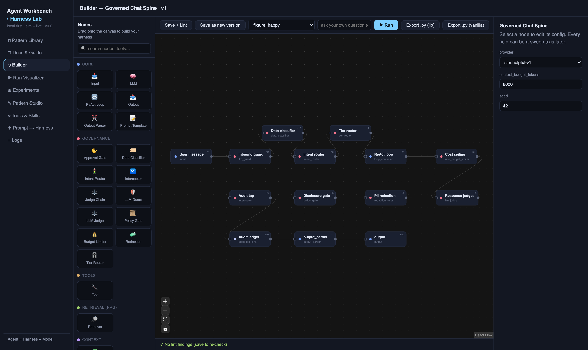

# exp-007 — governance topology sweeps

The runnable proof behind the post **[*The Spine, Drawn*](https://www.tech4talk.com/blog/local-ai/the-spine-drawn/)**.

The last experiment ([exp-006](../exp-006-deterministic-harness-spine/)) argued
the harness is a deterministic spine, and the guards — not the model-judges — do
the stopping. This one takes that spine off the page and onto a bench: the
governance path rebuilt as an explicit **graph** where every gate is a node.
When the harness is a graph, governance stops being an *aspect* (a "nothing
bypasses this" test you keep passing) and becomes *topology* (the bypass is an
edge that doesn't exist) — and because it's declarative and deterministic, you
can **sweep the safety knobs and read the line off a table.**

That last part is what ships here: three governance sweeps, run on the **real
Harness Lab engine** (no mock), each moving one knob across its range and grading
the **outcome** of every grid cell — which gate fired, whether the model was
reached, whether the answer shipped — not the prose.

## The harness, as a graph

Governance as topology: the only path from input to output runs through the
gates, so there is no bypass to test for. The three gates the sweeps move are
highlighted.

```mermaid
flowchart LR
    IN([input]) --> GUARD[llm_guard]
    GUARD --> CLASSIFY{{data_classifier<br/>+ egress law}}:::swept
    CLASSIFY --> ROUTE[intent_router]
    ROUTE --> TIER{{tier_router<br/>+ downshift}}:::swept
    TIER --> LOOP[loop_controller]
    LOOP --> BUDGET[rate_budget_limiter]
    BUDGET --> JUDGE{{llm_judge<br/>threshold}}:::swept
    JUDGE --> REDACT[redaction_rules]
    REDACT --> POLICY[policy_gate]
    POLICY --> AUDIT[audit_log_sink]
    AUDIT --> PARSE[output_parser]
    PARSE --> OUT([output])
    classDef swept fill:#132a22,stroke:#34d399,color:#e8ebf2,stroke-width:2px;
```



The same graph on the Harness Lab canvas — every gate a node, every field a
sweep axis: 

(Mermaid source: [assets/governed-chat-spine.mmd](assets/governed-chat-spine.mmd).)

## The three sweeps

| Sweep | Knob | Finding |
| --- | --- | --- |
| **Egress mode** | `data_classifier.egress` = off / warn / enforce | On personal data → a cloud model, only `enforce` blocks before the model is reached. `warn` records the violation *after* the bytes have crossed — an audit signal, not a control. |
| **Forbidden-tier fallback** | `tier_router.on_forbidden_egress` = downshift / warn / block | A personal request whose intent maps to a cloud tier: `warn` and `block` both stop the turn; only `downshift` keeps it alive by routing to a local tier the egress law permits — safe *and* answered. |
| **Curation threshold** | `llm_judge.threshold` = 0.3 / 0.6 / 0.9 | On a confidently-wrong answer (evidence said $212.40, the model said $305), the line between "shipped to the user" and "caught and blocked" is a single number — visible before you deploy. |

The generated tables are in [RESULTS.md](RESULTS.md); the raw run log is
[assets/run-log.txt](assets/run-log.txt); the harness under sweep is pictured in
[assets/](assets/) (diagram + a shot of it on the Harness Lab canvas).

## Run it

The kit runs the **real** engine — it imports `harnesslab` and executes the
actual deterministic graph runs. It ships only what this experiment needs: three
graphs, three fixtures, and a ~170-line runner you can read in full.

```bash
cd sweep-kit
pip install -r requirements.txt     # the real Harness Lab engine (opening soon)
bash demo.sh                        # runs all three sweeps, prints the tables
```

`demo.sh` exits `0` iff every cell matches its expected outcome — drop it in CI.
Determinism is the contract: same graph + same fixture + same seed ⇒ the same
event trace, so your tables match these byte for byte. No API key needed — the
egress "did personal data reach the cloud model" signal is the `llm_request`
event, which the engine emits at the boundary *before* any network call.

## The honest boundary

These are runs on the **bench** — deterministic fixtures, synthetic by design (a
made-up SSN, a scripted wrong price). They prove the *shape* behaves as drawn,
reproducibly; they are **not** the adversarial production numbers from exp-006's
red-team, which fired real probes at the real agent. The architecture findings
travel — egress as topology, downshift-not-refuse, the threshold as a visible
line — but the exact fixtures are illustrative, and the whole graph is yours to
point at your own data. Reproducible, or it didn't happen.
